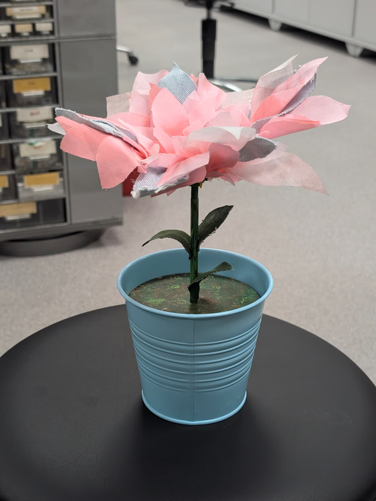
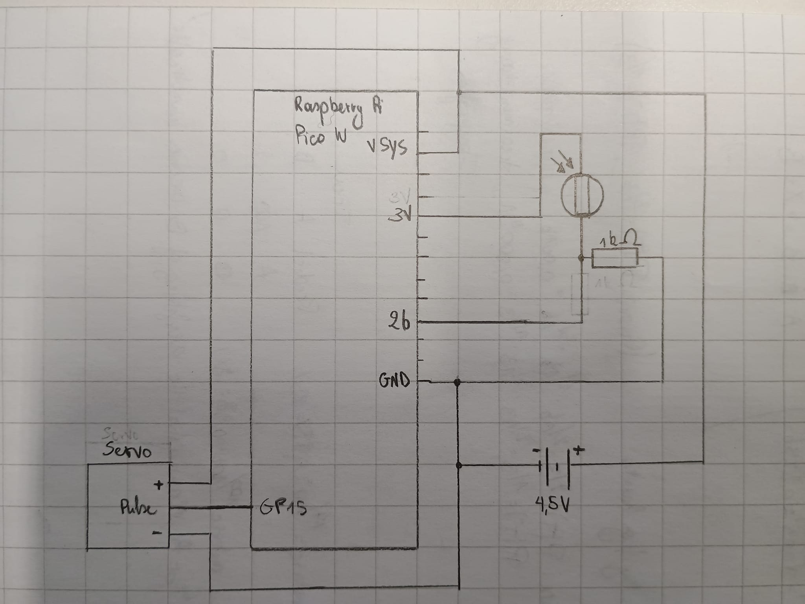

# bl00m
By @torwanat @talahuhta @Fennel23 @siemkehvanreyn-source

## Overview
bl00m is a flower that blooms when there is light, and closes when it is dark. In the plant pot, there is a photoresistor to keep track of brightness. Once a certain threshold has been observed, and it is considered dark, the servo will rotate tightening the strings to close the flower. Alternatively, once it is light enough, the servo will loosen the strings, letting the rubber bands pull the petals open.

## Materials used
- ± 500 cm² cardboard
- 71.25g PLA
- 3 mm MDF 266.75 cm²
- 0.2 m² fabric
- 1x Raspberry Pi Pico
- 1x Large breadboard
- 1x Servo motor
- 1x Photoresistor
- 1x 1k Ohm resistor
- 1x Battery pack
- 3x AA battery
- 9x breadboard wire
- 4x small screw
- 4x small nut

## Diagram of Electronics

## Development process
The project has been developed over multiple iterations. Starting with design sketches and cardboard prototypes allowed for more experimentation and fine tuning. The flower bud mechanism in particular required many prototypes until the right design has been developed. Similar, but not as demanding challenges were presented by the design of the stem and its attachement both to the bud and to the assembly. After many iterations, the final design present a clean and complete solution, with easy accesibility to electronics and high modularity, including easy changing of the petals.

## Project description
The project consist of a repurposed flower pot housing an electronics assembly. The assembly is located between two laser cut MDF plates and consists of a Raspberry Pi Pico controlling a servo motor based on photoresistor inputs (diagram visible above). The assembly, as well as battery pack located on the bottom of the lower MDF plate, are not visible from the outside, yet they can be easily accessed by grabbing the stem and taking them out of the pot. The servo mounting point, the stem and the flower bud are 3D printed from green PLA and then painted, to give them a natural look. The petals were made by attaching colored textiles to a 3D printed attachment point, and then screwing it to the bud mechanism. This makes them easily adjustable or changeable. To make the look more natural, upper MDF plate is painted in green colors, and textile leaves are attached to the stem. Thanks to this efforts, the project looks clean and tidy, while also being modular and providing easy access to its internal components.
